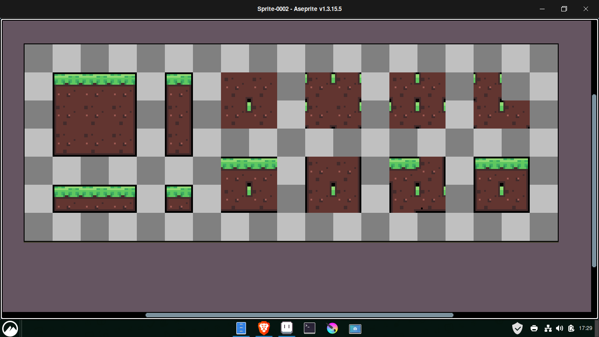

# Profil Website

A personal portfolio website built with HTML and CSS.

## 📄 Pages
- `index.html`: Homepage
- `profilpage.html`: Profile details
- `projectspage.html`: Projects showcase
- `artworkpage.html`: Artwork gallery

## 🚀 Features
- Responsive design
- Clean layout
- Easy navigation

## 📸 Screenshots

## 🛠 How to Run Locally
1. Clone the repo: `git clone https://github.com/not-wallx/Profil-websit.git`
2. Open `index.html` in your browser

## 📌 Improvements Planned
- Add animations
- Make it responsive on mobile
- Add contact form
